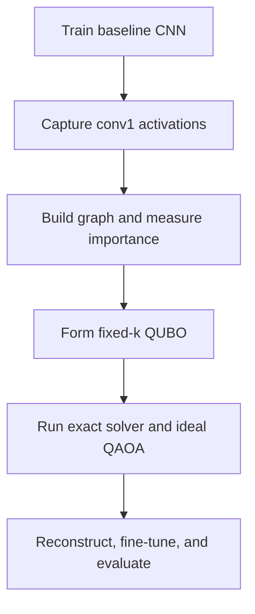

# QFeatureGraph

Graph-based structured CNN channel pruning with exact QUBO optimization and an ideal QAOA comparison.

> **Status:** Repository scaffold and proof-of-concept specification are complete. Implementation has not started.

QFeatureGraph is a reproducible proof-of-concept investigating whether graph structure can improve fixed-cardinality channel pruning in a small convolutional neural network (CNN). It represents hidden channels as nodes, estimates redundancy from activation correlations, measures importance by channel ablation, formulates selection as a quadratic unconstrained binary optimization (QUBO) problem, and compares exact, importance-only, and ideal quantum approximate optimization algorithm (QAOA) selections.

## Research question

For a fixed number of retained first-layer CNN channels, can an objective that balances ablation importance against pairwise activation redundancy retain predictive performance better or more consistently than importance-only selection?

## PoC pipeline



The canonical objective is minimized:

$$
E(x) = -\alpha\sum_i I_i x_i
+ \beta\sum_{i<j}R_{ij}x_ix_j
+ \lambda\left(\sum_i x_i-k\right)^2,
$$

where $x_i=1$ means channel $i$ is retained, $I_i$ is transformed ablation importance, $R_{ij}=\max(0,\rho_{ij})$ is positive Pearson-correlation redundancy, and $k=4$ is the required retained-channel count.

## Frozen version 1 scope

- Fashion-MNIST with deterministic 50,000 train, 5,000 calibration, and 5,000 validation partitions.
- The official 10,000-image test split held out until the final protocol is frozen.
- A fixed `Conv(1 -> 8) -> Conv(8 -> 16) -> Linear(784 -> 64) -> Linear(64 -> 10)` CNN.
- Eight post-ReLU `conv1` channels as graph nodes.
- Global-average channel responses and signed Pearson correlation for analysis.
- Positive correlation only as the QUBO redundancy penalty.
- Single-channel masking loss change as importance, with raw negative values preserved.
- Fixed-cardinality selection of four channels.
- Importance-only top-k, exact graph/QUBO, and ideal depth-1 QAOA selectors.
- Masked, structurally reconstructed, and fine-tuned evaluations across three training seeds.

The authoritative details are in the [frozen PoC specification](docs/frozen_poc_specification.md), [mathematical conventions](docs/mathematical_conventions.md), and [experimental protocol](docs/experimental_protocol.md).

## Required comparisons

| Experiment | Purpose |
|---|---|
| Unpruned CNN | Establish predictive, parameter, and size baselines |
| Importance-only top-k | Test whether graph structure adds value |
| Exact graph/QUBO | Provide the reference graph-based subset |
| Ideal QAOA | Demonstrate and evaluate quantum-workflow integration |
| Masked original | Measure the immediate selection effect |
| Structurally reconstructed | Confirm real parameter reduction |
| Fine-tuned reconstructed | Measure recoverable predictive performance |
| Remove-selected ablation | Check whether selected channels are genuinely important |

## Explicit nonclaims

- QAOA integration does not demonstrate quantum advantage.
- Correlation is evidence of possible redundancy, not causation.
- Exact enumeration is the reference optimizer because eight binary variables produce only 256 assignments.
- Version 1 results apply only to the frozen Fashion-MNIST PoC unless later experiments establish broader validity.
- QPU execution, noise studies, deeper QAOA, and multiple architectures are outside version 1.
- Runtime is not treated as acceleration evidence unless measurement conditions are controlled and reported.

## Repository structure

The tracked structure below is current for the scaffold. Git does not track empty directories, so small `README.md` policy files preserve the planned directories until implementation files replace them.

```text
QFeatureGraph/
├── .github/
│   └── pull_request_template.md
├── artifacts/
│   └── README.md
├── configs/
│   ├── README.md
│   ├── poc_v1.yaml
│   └── smoke_test.yaml
├── data/
│   └── README.md
├── docs/
│   ├── decisions.md
│   ├── experimental_protocol.md
│   ├── frozen_poc_specification.md
│   ├── mathematical_conventions.md
│   ├── project_scope.md
│   ├── references.bib
│   ├── reproducibility.md
│   ├── results_schema.md
│   └── roadmap.md
├── notebooks/
│   └── README.md
├── results/
│   └── README.md
├── src/
│   ├── README.md
│   └── qfeaturegraph/
│       ├── README.md
│       ├── data/
│       │   └── README.md
│       ├── evaluation/
│       │   └── README.md
│       ├── feature_graph/
│       │   └── README.md
│       ├── models/
│       │   └── README.md
│       ├── optimization/
│       │   └── README.md
│       └── pruning/
│           └── README.md
├── tests/
│   └── README.md
├── .gitattributes
├── .gitignore
├── CITATION.cff
├── LICENSE
├── pyproject.toml
└── README.md
```

Once implementation begins, the package is planned to add `cli.py`, `config.py`, and `reproducibility.py`, plus the focused modules listed in each source-directory README. Core scientific logic belongs in `src/qfeaturegraph/`; notebooks may consume the package but must not become the sole implementation.

## Environment setup

The dependency groups are declared in `pyproject.toml`. Before implementation starts, a development environment can be prepared with:

```bash
git clone https://github.com/aghast648/QFeatureGraph.git
cd QFeatureGraph
python -m venv .venv
source .venv/bin/activate
python -m pip install --upgrade pip
python -m pip install -e ".[dev,quantum]"
```

Windows PowerShell uses `.venv\Scripts\Activate.ps1` instead of `source .venv/bin/activate`. Executable training and reproduction commands will be documented with the first implementation; the repository currently contains no runnable experiment code.

## Reproducibility contract

- `configs/poc_v1.yaml` is the canonical experiment contract; `configs/smoke_test.yaml` is the fast end-to-end check.
- A result-producing configuration is never overwritten. Changes create a new versioned configuration and decision record.
- Downloaded datasets, checkpoints, activations, and raw runs remain outside normal Git history.
- Curated lightweight metrics, graph tables, selections, manifests, and figures may be committed under `results/`.
- Every run records configuration and Git hashes, split indices, seeds, environment, hardware, graph values, QUBO coefficients, bit ordering, selections, metrics, warnings, and failures.
- QUBO/direct-score equivalence, Ising equivalence, cardinality, reconstruction, and Qiskit bit decoding are release-blocking tests.

See [reproducibility](docs/reproducibility.md), the [results schema](docs/results_schema.md), and the [test plan](tests/README.md).

## Project roadmap

The [eight-week roadmap](docs/roadmap.md) progresses from deterministic data and a baseline CNN through feature-graph construction, exact QUBO validation, structural pruning, ideal QAOA, repeated experiments, interpretation, and a reproducible release. Notion is the task-status source of truth; GitHub is the source of truth for specifications, implementation, tests, configurations, and experimental evidence.

## License and citation

Code and repository documentation are released under the [MIT License](LICENSE). Citation metadata is provided in [CITATION.cff](CITATION.cff). The initial technical bibliography is in [docs/references.bib](docs/references.bib).

